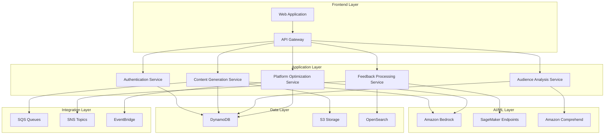

# Design Document: ContentFlow AI

## Overview

ContentFlow AI is a serverless, AI-driven content generation platform built on AWS that transforms single content ideas into personalized, platform-optimized content. The system leverages Amazon Bedrock for AI content generation, implements a feedback learning loop for continuous improvement, and provides scalable, secure content creation across multiple formats including blogs, social media posts, captions, and scripts.

The architecture follows a microservices pattern with clear separation of concerns, utilizing AWS serverless technologies for elastic scaling and cost optimization. The platform incorporates real-time content generation, audience analysis, platform optimization, and machine learning-driven personalization based on engagement feedback.

## Architecture

### High-Level Architecture



### Deployment Architecture

The system is deployed using AWS serverless technologies:

- **Compute**: AWS Lambda functions for all business logic
- **API Management**: Amazon API Gateway for REST API endpoints
- **Authentication**: Amazon Cognito for user management
- **AI Services**: Amazon Bedrock for content generation, Amazon Comprehend for text analysis
- **Storage**: DynamoDB for structured data, S3 for content storage, OpenSearch for analytics
- **Messaging**: SQS for asynchronous processing, SNS for notifications, EventBridge for event routing
- **Monitoring**: CloudWatch for logging and metrics, X-Ray for distributed tracing

## Components and Interfaces

### 1. Authentication Service

**Responsibilities:**
- User registration and login management
- JWT token generation and validation
- User profile and preference management
- Session management and security

**Key Interfaces:**
- `POST /auth/register` - User registration
- `POST /auth/login` - User authentication
- `GET /auth/profile` - Retrieve user profile
- `PUT /auth/profile` - Update user preferences

**Implementation:**
- AWS Lambda function integrated with Amazon Cognito
- DynamoDB table for user preferences and metadata
- JWT tokens for stateless authentication

### 2. Content Generation Service

**Responsibilities:**
- Process content ideas and generate platform-specific content
- Coordinate with audience analysis and platform optimization
- Manage content templates and formatting rules
- Handle content versioning and storage

**Key Interfaces:**
- `POST /content/generate` - Generate content from idea
- `GET /content/{id}` - Retrieve generated content
- `PUT /content/{id}` - Update content
- `GET /content/history` - User content history

**Implementation:**
- AWS Lambda function with Amazon Bedrock integration
- DynamoDB for content metadata and user associations
- S3 for content storage with versioning
- SQS for asynchronous content processing

### 3. Audience Analysis Service

**Responsibilities:**
- Analyze target audience characteristics from content ideas
- Extract demographic and psychographic insights
- Maintain audience profiles and preferences
- Provide audience-specific content recommendations

**Key Interfaces:**
- `POST /audience/analyze` - Analyze audience from content idea
- `GET /audience/profile/{userId}` - Get user's audience profile
- `PUT /audience/profile/{userId}` - Update audience preferences

**Implementation:**
- AWS Lambda function with Amazon Comprehend integration
- Custom ML models for audience segmentation
- DynamoDB for audience profiles and analytics

### 4. Platform Optimization Service

**Responsibilities:**
- Adapt content for specific platforms (blog, social media, etc.)
- Apply platform-specific formatting and constraints
- Optimize content for SEO and engagement
- Manage platform templates and best practices

**Key Interfaces:**
- `POST /platform/optimize` - Optimize content for platform
- `GET /platform/templates` - Get platform templates
- `GET /platform/guidelines/{platform}` - Platform-specific guidelines

**Implementation:**
- AWS Lambda function with platform-specific optimization logic
- Amazon Bedrock for content adaptation
- DynamoDB for platform templates and rules
- EventBridge for platform-specific event handling

### 5. Feedback Processing Service

**Responsibilities:**
- Collect and process engagement feedback data
- Analyze content performance patterns
- Update ML models based on feedback
- Generate insights and recommendations

**Key Interfaces:**
- `POST /feedback/submit` - Submit engagement data
- `GET /feedback/analytics/{userId}` - User performance analytics
- `GET /feedback/insights` - Content performance insights

**Implementation:**
- AWS Lambda function for feedback processing
- Amazon SageMaker for ML model training and inference
- OpenSearch for analytics and pattern recognition
- SNS for real-time feedback notifications

## Data Models

### User Profile
```json
{
  "userId": "string",
  "email": "string",
  "preferences": {
    "brandVoice": "string",
    "targetAudience": "object",
    "preferredPlatforms": ["string"],
    "contentStyle": "string"
  },
  "createdAt": "timestamp",
  "updatedAt": "timestamp"
}
```

### Content Idea
```json
{
  "ideaId": "string",
  "userId": "string",
  "content": "string",
  "extractedThemes": ["string"],
  "targetAudience": "object",
  "intent": "string",
  "confidenceScore": "number",
  "createdAt": "timestamp"
}
```

### Generated Content
```json
{
  "contentId": "string",
  "ideaId": "string",
  "userId": "string",
  "platform": "string",
  "contentType": "string",
  "generatedText": "string",
  "metadata": {
    "wordCount": "number",
    "hashtags": ["string"],
    "seoKeywords": ["string"],
    "readingTime": "number"
  },
  "version": "number",
  "status": "string",
  "createdAt": "timestamp"
}
```

### Engagement Feedback
```json
{
  "feedbackId": "string",
  "contentId": "string",
  "userId": "string",
  "platform": "string",
  "metrics": {
    "likes": "number",
    "shares": "number",
    "comments": "number",
    "clickThroughRate": "number",
    "engagementRate": "number"
  },
  "timestamp": "timestamp"
}
```

### Audience Profile
```json
{
  "profileId": "string",
  "userId": "string",
  "demographics": {
    "ageRange": "string",
    "location": "string",
    "interests": ["string"]
  },
  "behaviorPatterns": {
    "preferredContentTypes": ["string"],
    "engagementTimes": ["string"],
    "platformUsage": "object"
  },
  "updatedAt": "timestamp"
}
```

## Correctness Properties

*A property is a characteristic or behavior that should hold true across all valid executions of a system—essentially, a formal statement about what the system should do. Properties serve as the bridge between human-readable specifications and machine-verifiable correctness guarantees.*

After analyzing the acceptance criteria, I identified several redundant properties that can be consolidated. For example, properties testing different content formats (blog, social media, captions, scripts) can be combined into comprehensive content generation properties. Similarly, properties testing various data storage and retrieval operations can be unified into data persistence properties.

### Property 1: Content Input Validation
*For any* text input, the system should accept inputs up to 500 characters and reject inputs exceeding this limit with appropriate error messages
**Validates: Requirements 1.1**

### Property 2: Content Processing Performance
*For any* valid content idea, the system should extract key themes and topics within 5 seconds
**Validates: Requirements 1.2**

### Property 3: Content Idea Persistence
*For any* submitted content idea, the system should store it persistently and make it retrievable for future reference
**Validates: Requirements 1.4**

### Property 4: Audience Analysis Completeness
*For any* content input, the audience analyzer should identify demographic characteristics and provide confidence scores within valid ranges (0-1)
**Validates: Requirements 2.1, 2.4**

### Property 5: Intent Classification Accuracy
*For any* content input, the system should classify intent as one of the four valid categories: informational, promotional, educational, or entertainment
**Validates: Requirements 2.2**

### Property 6: Platform-Specific Content Constraints
*For any* content generation request, the system should respect platform-specific constraints including character limits for social media, word count ranges for blogs (800-2000), and required elements for captions and scripts
**Validates: Requirements 3.1, 3.2, 3.3, 3.4**

### Property 7: Brand Voice Consistency
*For any* user with defined brand voice preferences, all generated content across different platforms should maintain consistent tone and style characteristics
**Validates: Requirements 3.5, 4.2**

### Property 8: Content Quality Standards
*For any* generated content, the output should be grammatically correct, coherent, and free from harmful or inappropriate material
**Validates: Requirements 4.1, 4.3**

### Property 9: Content Variation Generation
*For any* content generation request, the system should provide multiple distinct variations for user selection
**Validates: Requirements 4.4**

### Property 10: Feedback Processing Completeness
*For any* engagement data submission, the system should analyze all provided metrics (likes, shares, comments, click-through rates) and identify performance patterns
**Validates: Requirements 5.1, 5.2**

### Property 11: Learning Integration
*For any* content generation request from a user with historical feedback data, the system should incorporate learned preferences and successful patterns into new content
**Validates: Requirements 5.3**

### Property 12: Profile Separation
*For any* user generating content across different platforms and content types, the system should maintain separate learning profiles for each combination
**Validates: Requirements 5.4**

### Property 13: User Authentication Security
*For any* user registration and login process, the system should create secure profiles with encrypted credentials and maintain secure session management
**Validates: Requirements 6.1, 6.2**

### Property 14: User Preference Management
*For any* user preference update (brand voice, target audience, platform preferences), the system should store and apply these preferences to future content generation
**Validates: Requirements 6.3**

### Property 15: Content History Tracking
*For any* user content generation activity, the system should maintain complete history and generation statistics
**Validates: Requirements 6.4**

### Property 16: Response Time Performance
*For any* standard content generation request, the system should produce results within 30 seconds
**Validates: Requirements 7.1**

### Property 17: Error Handling Clarity
*For any* system error condition, the system should provide clear error messages and recovery options to users
**Validates: Requirements 7.4**

### Property 18: Data Encryption Security
*For any* sensitive user data storage operation, the system should apply industry-standard encryption
**Validates: Requirements 8.1**

### Property 19: Data Deletion Compliance
*For any* user data deletion request, the system should permanently remove all associated data within 30 days
**Validates: Requirements 8.3**

### Property 20: Export Format Support
*For any* content export request, the system should support plain text, HTML, and markdown formats while maintaining formatting and metadata integrity
**Validates: Requirements 9.1, 9.4**

### Property 21: API Endpoint Availability
*For any* third-party integration request, the system should provide accessible API endpoints for external applications
**Validates: Requirements 9.2**

### Property 22: Analytics and Reporting
*For any* user analytics request, the system should display content generation statistics, performance metrics, and provide export capabilities in CSV and PDF formats
**Validates: Requirements 10.1, 10.3**

### Property 23: Improvement Tracking
*For any* user with historical feedback data, the system should track and display improvement metrics showing how feedback learning enhances content quality over time
**Validates: Requirements 10.4**

## Error Handling

### Input Validation Errors
- **Invalid Content Length**: Return HTTP 400 with specific character limit information
- **Malformed Input**: Return HTTP 400 with clear description of expected format
- **Missing Required Fields**: Return HTTP 400 with list of missing fields

### Authentication Errors
- **Invalid Credentials**: Return HTTP 401 with generic authentication failure message
- **Expired Session**: Return HTTP 401 with session renewal instructions
- **Insufficient Permissions**: Return HTTP 403 with required permission information

### Content Generation Errors
- **AI Service Unavailable**: Return HTTP 503 with retry-after header
- **Content Generation Timeout**: Return HTTP 408 with partial results if available
- **Inappropriate Content Detected**: Return HTTP 422 with content policy information

### Data Processing Errors
- **Database Connection Failure**: Implement exponential backoff retry with circuit breaker
- **Storage Service Unavailable**: Queue requests for later processing
- **Analytics Service Failure**: Degrade gracefully, continue core functionality

### Rate Limiting
- **Request Rate Exceeded**: Return HTTP 429 with rate limit headers and reset time
- **Quota Exceeded**: Return HTTP 402 with upgrade information for premium features

### Recovery Mechanisms
- **Automatic Retry**: Implement for transient failures with exponential backoff
- **Graceful Degradation**: Provide basic functionality when advanced features fail
- **Circuit Breaker**: Prevent cascade failures in microservices architecture
- **Dead Letter Queues**: Capture failed messages for manual review and reprocessing

## Testing Strategy

### Dual Testing Approach

The ContentFlow AI platform requires comprehensive testing using both unit tests and property-based tests to ensure correctness and reliability:

**Unit Tests** focus on:
- Specific examples demonstrating correct behavior for each content type
- Integration points between microservices
- Edge cases and error conditions
- Authentication and authorization flows
- API endpoint functionality

**Property-Based Tests** focus on:
- Universal properties that hold across all inputs and scenarios
- Content generation quality and consistency
- Data integrity and persistence
- Performance characteristics under various loads
- Security and privacy requirements

### Property-Based Testing Configuration

The system uses **Hypothesis** (Python) for property-based testing with the following configuration:
- **Minimum 100 iterations** per property test to ensure comprehensive input coverage
- Each property test references its corresponding design document property
- Tag format: **Feature: contentflow-ai, Property {number}: {property_text}**

### Testing Implementation Requirements

**Content Generation Testing**:
- Generate random content ideas with various characteristics (length, complexity, topics)
- Test all supported platforms (blog, social media, captions, scripts) with random parameters
- Verify output quality, format compliance, and performance requirements
- Test feedback integration with synthetic engagement data

**Security and Privacy Testing**:
- Test encryption of sensitive data with various input types
- Verify authentication flows with different user scenarios
- Test data deletion compliance with comprehensive user data sets
- Validate API security with various access patterns

**Performance Testing**:
- Test response times with varying content complexity and system load
- Verify scalability characteristics under simulated high-traffic conditions
- Test error handling and recovery mechanisms under failure scenarios

**Integration Testing**:
- Test end-to-end workflows from content idea to published content
- Verify data consistency across all microservices
- Test external API integrations with mock services
- Validate analytics and reporting accuracy with known data sets

Each correctness property must be implemented by a single property-based test that validates the universal behavior described in the property statement. Unit tests complement these by testing specific examples and edge cases that demonstrate the property in action.